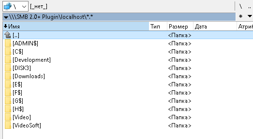
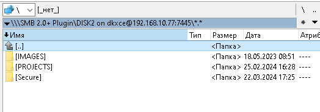

### Total Commander (Windows) File Plugin (WFX) for SMB2.0/SMB2.1/SMB3.0 Server ###

Main Features:     
==============     
- Allow to change standard port (not 445) / non-standard ports
- [Total Commander](https://www.ghisler.com/) WFX plugin ([wiki](https://www.ghisler.ch/wiki/index.php/Plugin))
- Supports [SMBLibrary 1.5.1 SVC Server by dkxce](https://github.com/dkxce/SMBLibrary)
- Supports Samba / SMB 2.0 (Network Windows File Sharing)
- Supports Samba / SMB 2.1 (Network Windows File Sharing)
- Supports Samba / SMB 3.0 (Network Windows File Sharing)

     
     
